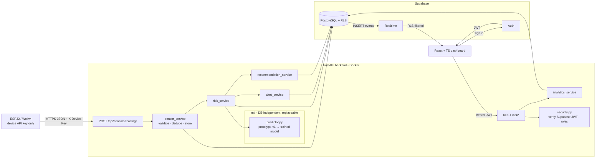
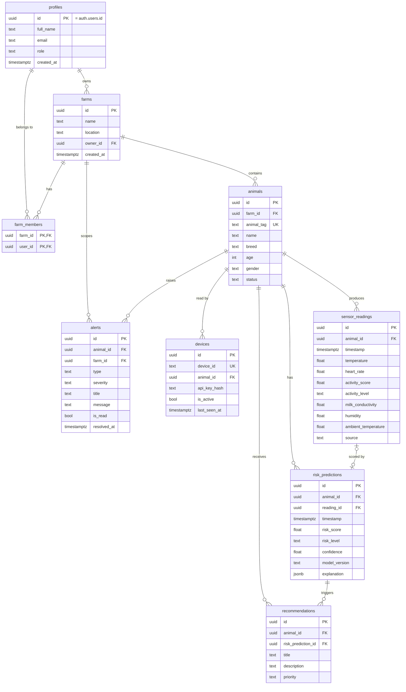

# MastiGuard Backend — Design (v2, Supabase)

> Risk scores and recommendations are **decision-support indicators from a prototype model, not a clinical diagnosis or treatment instruction.**

This version replaces the earlier Docker-PostgreSQL design. Supabase is the database platform; **FastAPI remains the only place for validation, risk calculation and business logic.**

## 1. Architecture



### Two access paths to the data

| Path | Credential | RLS applies? | Used for |
|---|---|---|---|
| Browser → Supabase (supabase-js: Auth, Realtime) | user JWT + anon key | **Yes** | sign-in, live updates (read-only) |
| FastAPI → Supabase PostgreSQL | DB role from `SUPABASE_DB_URL` (+ service-role key for Auth admin calls) | **No** (bypassed) | all writes, ingestion, analytics |

Because the backend bypasses RLS, **every endpoint enforces authorization in code** (`access_service`: user → accessible farms → animals). RLS is the second wall protecting direct browser access and Realtime.

### Key decisions (please confirm)

| # | Decision | Reason |
|---|---|---|
| D1 | **SQLAlchemy over `SUPABASE_DB_URL`** for data access; `supabase-py` only for Supabase Auth / admin calls. | History bucketing, herd stats and trends are aggregate SQL — awkward through PostgREST. |
| D2 | **Schema managed by SQL files** in `supabase/migrations/` (Supabase CLI compatible). Alembic dropped. | One source of truth; includes RLS, triggers, Realtime publication, which Alembic doesn't model well. |
| D3 | **Frontend signs in directly with Supabase Auth.** FastAPI verifies the access token (JWKS for asymmetric projects, `SUPABASE_JWT_SECRET` for legacy HS256; checks `exp`, `iss`, `aud=authenticated`). `POST /api/auth/login` is an optional proxy for Swagger/testing; it uses the anon key, not the service key. | Matches your recommended architecture; passwords never touch our DB. |
| D4 | **ESP32 uses a per-device API key** (`X-Device-Key`), stored hashed (HMAC-SHA256 with `SECRET_KEY`). No Supabase key ever goes on the device. | ESP32/Wokwi can't safely hold secrets, and your rule forbids the service-role key there. |
| D5 | **Realtime replaces `WS /api/ws/live`.** Frontend subscribes to INSERTs on `risk_predictions` (≈ the `animal_update` event), `alerts` and optionally `sensor_readings`. | You asked for Supabase Realtime; avoids running two push channels. |
| D6 | **Self-signup can never create ADMIN** (trigger maps unknown/ADMIN roles to FARMER). Admins are promoted via SQL. | Otherwise anyone could pass `role: ADMIN` in sign-up metadata. |
| D7 | Added **`farm_members`**, **`devices`**, `alerts.farm_id`, `alerts.resolved_at`, `risk_predictions.reading_id`. | Vets/managers need farm access without owning it; devices need keys; alerts need farm scope for RLS and dedupe. |
| D8 | Milk-conductivity unit still unconfirmed (examples 320–620 look like simulated values; real milk is ~4–7 mS/cm). API range 0–2000, thresholds in config. | Recalibrate when the real sensor is known. |

## 2. Database schema

SQL: `supabase/migrations/20261005000000_init_schema.sql` (tables, indexes, constraints, sign-up trigger) and `20261005000100_rls_policies.sql` (helpers, grants, RLS, Realtime).



Notable constraints: unique `animal_tag`; unique `(animal_id, timestamp, coalesce(source,''))` blocks duplicate readings; partial unique indexes allow only one *open* alert per animal+type (and per farm for herd alerts); CHECKs on roles, levels, types and sensor ranges; indexes on `animal_id`, `timestamp`, `(animal_id, timestamp desc)`.

## 3. Row Level Security

| Table | Client (authenticated) can | Policy |
|---|---|---|
| profiles | read own (ADMIN: all); update `full_name` only | `id = auth.uid() or is_admin()` |
| farms, farm_members, animals | read | `can_access_farm(farm)` — owner, member, or ADMIN |
| sensor_readings, risk_predictions, recommendations | read | `can_access_animal(animal_id)` |
| alerts | read | `can_access_farm(farm_id)` |
| devices | **nothing** (RLS on, no policies, no grants) | key hashes unreachable from browsers |
| all | no insert/update/delete | writes happen only in FastAPI |
| `anon` role | **nothing** | grants revoked |

Helper functions are `SECURITY DEFINER` with `search_path=''` (prevents recursive policies and search-path hijacking) and are not executable by `anon`. Performance note: per-row `can_access_animal()` is fine at prototype scale; if readings grow large, denormalize `farm_id` onto `sensor_readings` and simplify the policy.

**Role matrix (enforced in FastAPI by `require_roles` + farm scope)**

| Role | Farm scope | Capabilities |
|---|---|---|
| FARMER | owned + member farms | read everything; create farms/animals/devices; add members; mark alerts read |
| VETERINARIAN | member farms | read everything; mark alerts read |
| DAIRY_MANAGER | member farms | read everything incl. analytics; mark alerts read; create animals |
| ADMIN | all farms | everything |

Inaccessible and non-existent animals both return 404 (no existence leak).

## 4. API endpoints

Auth: **JWT** = Supabase access token as `Authorization: Bearer`. **Device** = `X-Device-Key`.

| Method | Path | Auth | Phase | Description |
|---|---|---|---|---|
| GET | `/health` | none | 1 | Liveness |
| GET | `/health/ready` | none | 1 | Supabase DB + API reachability (503 if down) |
| POST | `/api/auth/login` | none | 2 | Optional proxy to Supabase password login |
| GET | `/api/auth/me` | JWT | 2 | Profile + role |
| POST / GET | `/api/farms` | JWT | 2 | Create / list accessible farms |
| POST | `/api/farms/{farm_id}/members` | JWT (owner/ADMIN) | 2 | Grant a vet/manager access |
| POST | `/api/animals` | JWT | 2 | Create animal |
| GET | `/api/animals` | JWT | 2 | `page, page_size, search, risk_level, farm_id` |
| GET | `/api/animals/{animal_id}` | JWT | 2/4 | Full current status |
| POST | `/api/sensors/devices` | JWT | 3 | Register device; key returned **once** |
| POST | `/api/sensors/readings` | Device (or JWT for demos) | 3 | Ingest; returns reading id and latest animal state |
| GET | `/api/animals/{animal_id}/latest` | JWT | 3 | Latest reading |
| GET | `/api/animals/{animal_id}/history` | JWT | 3/4 | `start_date, end_date, interval=raw\|15m\|1h\|6h\|1d` |
| GET | `/api/animals/{animal_id}/risk` | JWT | 4 | Latest prediction |
| GET | `/api/animals/{animal_id}/risk/history` | JWT | 4 | Prediction history |
| GET | `/api/risk/herd` | JWT | 4 | Herd distribution |
| GET | `/api/alerts` | JWT | 4 | `severity, type, animal_id, is_read`, pagination |
| GET | `/api/alerts/{alert_id}` | JWT | 4 | Detail |
| PATCH | `/api/alerts/{alert_id}/read` | JWT | 4 | Mark read |
| GET | `/api/dashboard/summary` | JWT | 5 | Dashboard summary |
| GET | `/api/analytics/risk-trend` | JWT | 5 | `days, animal_id` |
| GET | `/api/analytics/herd` | JWT | 5 | Herd analytics |
| GET | `/api/animals/{animal_id}/recommendations` | JWT | 5 | Decision-support guidance |

Realtime (Supabase, not FastAPI) from Phase 6: INSERT on `risk_predictions`, `alerts`, `sensor_readings`.

## 5. Request / response examples

**Error envelope (all errors)**
```json
{ "success": false, "error": { "code": "ANIMAL_NOT_FOUND", "message": "Animal A999 was not found" } }
```
Validation (422): `error.code = "VALIDATION_ERROR"` with `details: [{field, message}]`. Malformed JSON: 400 `MALFORMED_JSON`.

**Readiness** `GET /health/ready` → `200 {"status":"ok","checks":{"database":"ok","supabase_api":"ok"}}`; on failure `503` with the envelope and `details` naming the failing check.

**Auth (frontend, supabase-js)**
```ts
const { data } = await supabase.auth.signInWithPassword({ email, password });
fetch(`${API}/api/animals`, { headers: { Authorization: `Bearer ${data.session.access_token}` } });
```
`GET /api/auth/me` → `{"id":"<uuid>","email":"…","full_name":"…","role":"FARMER"}`

**Ingestion**
```http
POST /api/sensors/readings
X-Device-Key: <device key>
{ "animal_id": "A001", "timestamp": "2026-10-05T12:30:00Z", "temperature": 39.2, "heart_rate": 82,
  "activity_score": 65, "activity_level": "NORMAL", "milk_conductivity": 410,
  "humidity": 62, "ambient_temperature": 29.4, "source": "ESP32" }
→ 201 { "success": true, "reading_id": "<uuid>", "message": "Sensor reading stored successfully",
        "latest_state": { "animal_id": "A001", "risk_score": 18, "risk_level": "LOW", "timestamp": "…" } }
→ 401 INVALID_DEVICE_KEY · 404 ANIMAL_NOT_FOUND · 409 DUPLICATE_READING · 422 STALE_TIMESTAMP / VALIDATION_ERROR · 429 RATE_LIMITED
```
`animal_id` in the payload is the **animal tag** (`A001`). Responses use the tag as `id`, matching the brief's examples; internal UUIDs stay internal.

**Realtime subscription (frontend)**
```ts
supabase.channel("live")
  .on("postgres_changes", { event: "INSERT", schema: "public", table: "risk_predictions" }, onRisk)
  .on("postgres_changes", { event: "INSERT", schema: "public", table: "alerts" }, onAlert)
  .subscribe();
```
Payloads carry the animal UUID; use the `/api/animals` list (which includes UUID↔tag) or refetch `/api/animals/{id}/latest` to render the full state. Events are RLS-filtered per user.

Other responses (animal list/detail, history, risk, herd, dashboard, risk-trend, alerts, recommendations) keep exactly the shapes in the project brief and `docs` v1 examples; list endpoints use `{items, total, page, page_size}`.

## 6. Validation and risk engine

Unchanged from v1 and kept in code, not the frontend: temperature 30–45 °C, heart rate 20–220, activity 0–100, humidity 0–100, ambient −10–60, conductivity 0–2000 (D8); timestamp not >5 min in the future nor >24 h old; at least one measurement required; missing values stored as NULL (never zero); duplicates 409; per-device rate limit 60/min; offline monitor → `SENSOR_OFFLINE`.

`ml/predictor.py` defines a `RiskPredictor` protocol with **no database or HTTP imports**: input is a feature dict, output `{risk_score, risk_level, confidence, model_version, explanation}`. `prototype-v1` = weighted, explainable score (temperature 0.35, conductivity vs own baseline 0.30, activity 0.20, heart rate 0.10, trend 0.05; LOW <35, MEDIUM 35–64, HIGH ≥65). `risk_service` loads features from the DB, calls the predictor, persists the result. A trained model later only implements the protocol.

**Ingestion order (single DB transaction):** validate → authorize device → insert reading → predict → insert prediction → open/skip alert (dedupe) → insert recommendations on level change → commit. The commit triggers Realtime events, so the frontend never sees a reading without its prediction.

## 7. Folder structure

```
backend/
├── app/
│   ├── main.py
│   ├── core/       config.py  security.py  supabase.py  database.py  errors.py
│   ├── api/        deps.py  health auth animals farms sensors dashboard alerts analytics recommendations
│   ├── schemas/    common health auth animal sensor risk alert dashboard
│   ├── services/   health_service sensor_service risk_service alert_service analytics_service
│   │               recommendation_service access_service
│   └── ml/         predictor.py  features.py  model_loader.py
├── supabase/migrations/   (SQL: schema, RLS)
├── tests/
├── Dockerfile  docker-compose.yml (backend only)  requirements.txt  .env.example  README.md
```
Additions to your structure: `database.py` (SQLAlchemy engine, D1), `errors.py`, `deps.py`, `access_service`, `farms.py`, `features.py`, `supabase/migrations/`.

## 8. Environment setup

1. Create a Supabase project; run the two SQL files in order (SQL Editor or `supabase db push`).
2. Dashboard → Connect: copy the **Session pooler** URI into `SUPABASE_DB_URL` (the code switches it to the psycopg3 driver and disables prepared statements for pooler compatibility).
3. Project Settings → API Keys: copy URL, anon/publishable key, service-role/secret key.
4. `cp .env.example .env`; set `SECRET_KEY` (`openssl rand -hex 32`).
5. `docker compose up --build` → `/health/ready` should return 200.
6. Auth → Providers: keep Email enabled; for demos you may disable email confirmation.

Security checklist: `.env` is git-ignored; secrets are `SecretStr`; service-role key is read only in `core/supabase.py`; no endpoint returns config; ESP32 holds only its device key.

## 9. Development plan

| Phase | Scope | Done when |
|---|---|---|
| 1 ✅ | FastAPI, settings, Supabase DB + API connection, `/health`, `/health/ready`, error envelope, CORS, Docker, SQL migrations, tests | `/health/ready` is green against your Supabase project |
| 2 | Supabase JWT verification, `/auth/me`, role dependencies, farms, members, animals | Sign in via Supabase → create farm/animal → RLS and API scoping agree |
| 3 | Devices + keys, validated ingestion, dedupe, rate limit, latest/history | Good reading stored; bad data rejected with clear codes |
| 4 | `ml/` abstraction + prototype-v1, risk APIs, alerts with dedupe | One HIGH reading → exactly one HIGH_RISK alert |
| 5 | Dashboard, trend, herd analytics, recommendations | All frontend-contract endpoints stable |
| 6 | Realtime verified end-to-end, offline monitor, MQTT (optional), ESP32 example, demo seeder | Dashboard updates without refresh |
| 7 | Trained-model loader behind `RiskPredictor`, shadow comparison | Swap by config, no API change |
| 8 | Full pytest suite, README completion | Brief's test list covered |
